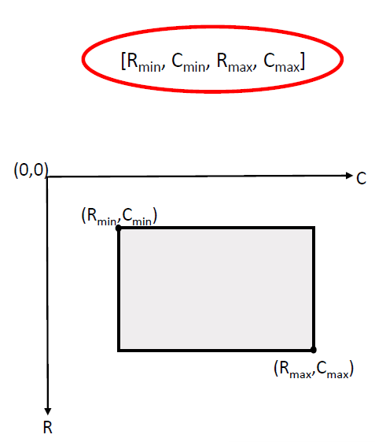

# SPARK 2022 Utils

This repository contains all you need to start playing around with the SPARK Dataset.

## Stream 1: spacecraft detection

Please first create a `data/` folder in `stream-1/`, then download the training and validation datasets in the newly created folder (see dedicated email for download link). After unziping the `*.zip` archives, the tree structure of `data/` must finally follow the one below:

<pre>
└───stream-1/
    ├───data/  
        ├───train/
        ├───val/
        ├───train.csv
        ├───val.csv
</pre>

The `stream-1/visualize_data.ipynb` notebook contains basic functions to load and display dataset samples.

The correspondences between class names and indexes are given below.

| Class                     | Name                      | Index    |
|---------------------------|---------------------------|----------|
| Proba 2                   | `proba_2`                 | 0        |
| Cheops                    | `cheops`                  | 1        |
| Debris                    | `debris`                  | 2        |
| Double star               | `double_star`             | 3        |
| Earth Observation Sat 1   | `earth_observation_sat_1` | 4        |
| Lisa Pathfinder           | `lisa_pathfinder`         | 5        |
| Proba 3 CSC               | `proba_3_csc`             | 6        |
| Proba 3 OCS               | `proba_3_ocs`             | 7        |
| Smart 1                   | `smart_1`                 | 8        |
| Soho                      | `soho`                    | 9        |
| Xmm Newton                | `xmm_newton`              | 10       |

The `bbox` cells must follow the format: `[R_min,C_min,R_max,C_max]`, where `R` refers to *row*, and `C` refers to *column*.

For this stream, localization accuracy (bounding box) will be evaluated in addition to classification performance. The metric is largely inspired by the COCO Challenge one. More precisely, we are going to compute the proportion of *correctly* predicted images, where a *correct* prediction refers to an image for which the predicted class is correct and the intersection-over-union (IoU) score between predicted and groundtruth bounding boxes is above a certain threshold. Finally, we are going to average these proportions over different IoU thresholds, to give more importance to more accurate results.

## Stream 2: spacecraft trajectory estimation

Please first create a `Data/` folder in `stream-2/`, then download the training and validation datasets in the newly created folder (see dedicated email for download link). After unziping the `*.zip` archives, the tree structure of `Data/` must finally follow the one below:

<pre>
└───stream-2/
    ├───Data/  
        ├───train/
            ├───images/
                ├───GTXXX/
                ├───...
            ├───train.csv
        ├───val/
            ├───images/
                ├───GTXXX/
                ├───...
            ├───val.csv
</pre>

The `stream-2/visualize_data_spark.py` script contains basic functions to load and display dataset samples.

For this stream, both position and orientation accuracies will be evaluated. The metric is largely inspired by the [SPEED+ Challenge](https://kelvins.esa.int/pose-estimation-2021/). More precisely, we are going to sum the relative position error and the geodesic orientation error for each frame, then average these scores over all the frames and trajectories.
